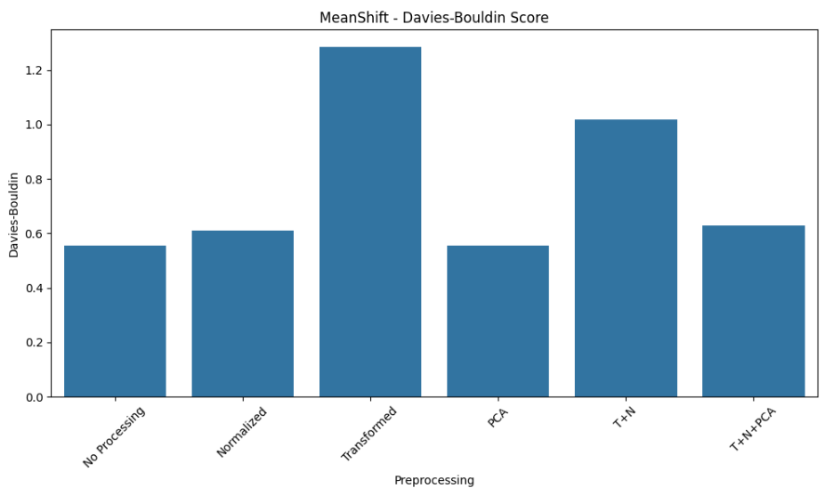

# Clustering Analysis with Wine Dataset

This repo compares KMeans, Hierarchical Clustering, and MeanShift on the Wine dataset using six preprocessing techniques.

## Preprocessing Techniques
1. No Processing  
2. Normalized  
3. Transformed  
4. PCA  
5. T+N (Transformed + Normalized)  
6. T+N+PCA  

## Results

### KMeans Clustering

#### Silhouette Score  

#### Calinski–Harabasz Score  

#### Davies–Bouldin Score  

**Observation:** Best separation and compactness with PCA or T+N+PCA.

---

### Hierarchical Clustering

#### Silhouette Score  

#### Calinski–Harabasz Score  

#### Davies–Bouldin Score  

**Observation:** Stable overall but higher Davies–Bouldin with raw/transformed data.

---

### MeanShift Clustering

#### Silhouette Score  

#### Calinski–Harabasz Score  

#### Davies–Bouldin Score  

**Observation:** Consistent across preprocessings; benefits from normalization and PCA.

---

### Best Clustering Configuration Based on TOPSIS
**Algorithm:** kmeans
**Preprocessing:** PCA
**Number of Clusters:** 5
**TOPSIS Score:** 0.9662
